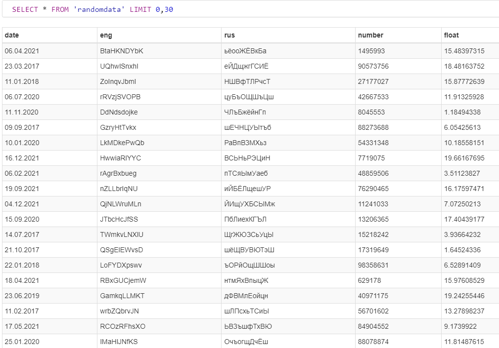

## Привет! Предствляю свой проект по работе с большими данными
---
Цель проекта - создать удобные скрипты для выполнения популярных операций с большими данными. Разработать веб-интерфейс.'=

> В работе использовал субд sqlite3
> Язык программирования Python3
> Web-frameworkd Django4
> Сторонние зависимости находятся в файле requirements.txt

## Исходные данные  

дные данные предствалены в деректории random_data_editor/files/
В целях экономии памяти мной было принять решение оставить в репозитории проекта всего 10 файлов по 100 строк каждый для тестирования.
Однако при запуске функции file_generate из файла utils.py будет воссоздана полная директория files/

## Структура проекта

* Все главные функции предствлены в файлах views.py и utils.py приложения random_data_editor
* В папке templates находятсяя html шаблоны
* В файле forms - форма для получения от пользователя фрагмента строк под удаление
* Основные эндпоинты проекта представлены в файле urls.py

## Далее пердставлен небольшой скринкаст проекта
### Фрагмент базы данных после импорта дынных

### Веб интерфейс

---

---

